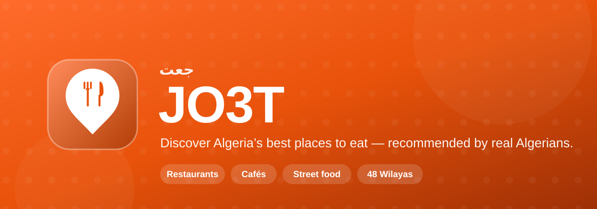
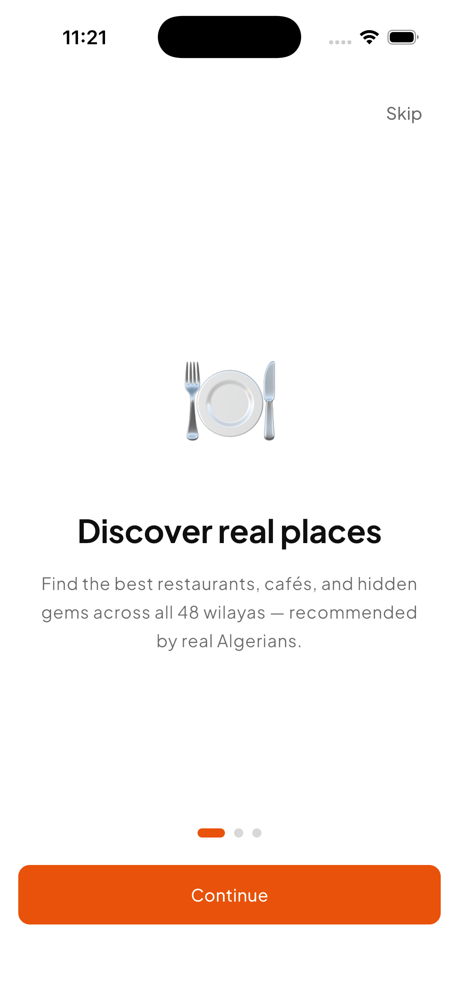
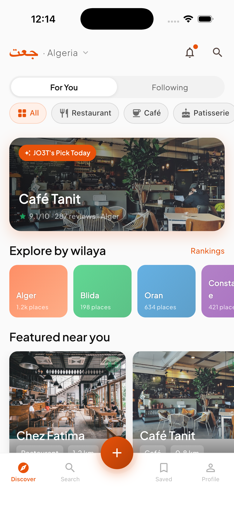
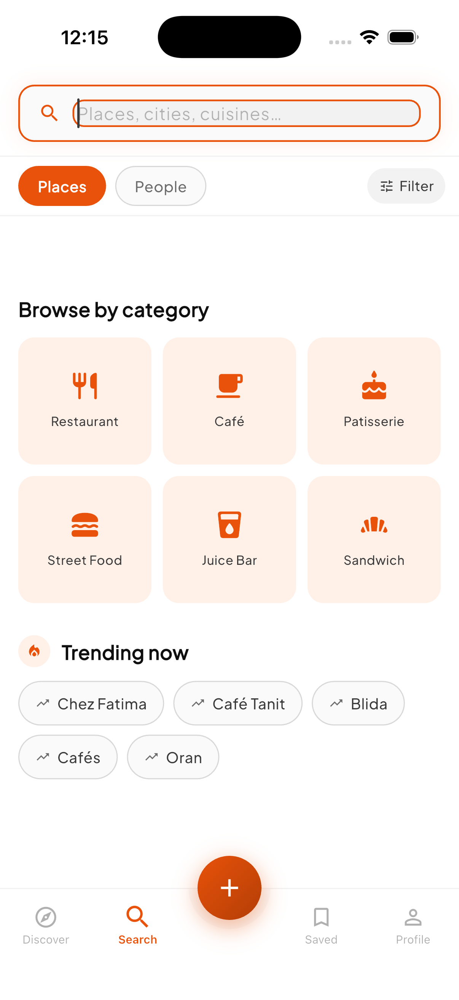
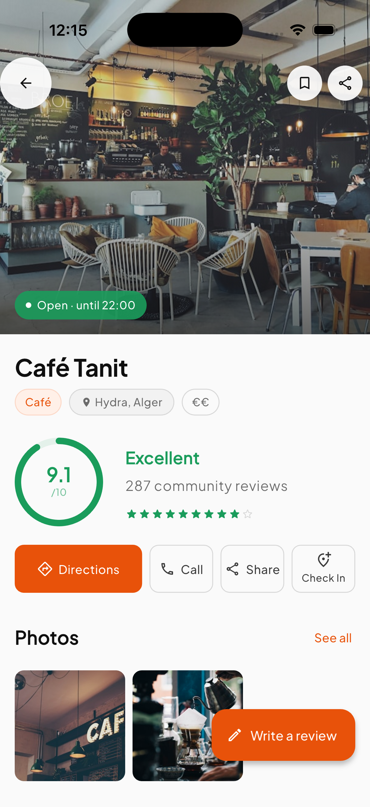
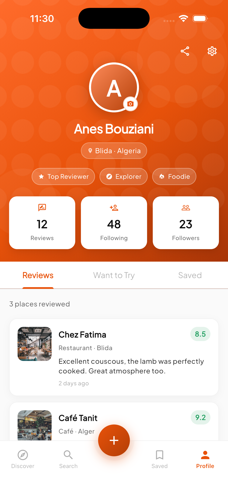
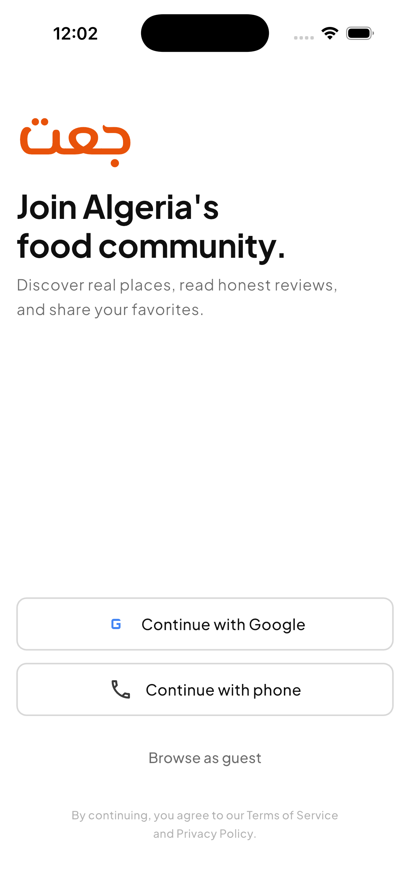

<div align="center">



<br/>


# JO3T

**Algeria's community-driven app for discovering the best places to eat, drink, and hang out.**

*discover · review · share*

<br/>


</div>

---

## ✦ What is JO3T?

JO3T (*جعت*) is a place-discovery app built for **one feeling: trusting where you eat.**

Finding a genuinely good restaurant, café, or hidden gem in Algeria usually means asking around. JO3T turns that word-of-mouth into an app — a feed of real places across all 48 wilayas, each with an honest **JO3T Score** built from community reviews, photos taken by real people, and recommendations from the friends you follow.

Browse by category or wilaya, open a place to see its score, hours, gallery and reviews, then save it, check in, or write your own review on a 1–10 scale. Discover something worth sharing, and share it.

> Built **Android-first** with Flutter, powered by Firebase, and wrapped in a warm, motion-rich interface where every transition is intentional.

---

## ✦ Screenshots

<div align="center">

| Onboarding | Home feed | Search |
|:---:|:---:|:---:|
|  |  |  |
| Discover real places, with a custom radar illustration | For You / Following feed, wilaya cards, JO3T's pick of the day | Browse by category, see what's trending now |

| Place profile | Profile | Sign in |
|:---:|:---:|:---:|
|  |  |  |
| The JO3T Score, directions, photos and actions | Achievement badges, stats and reviewed places | Join with Google, phone, or as a guest |

</div>

---

## ✦ Features

🧭 **A feed that knows Algeria**
Discover places by category and wilaya, switch between a personalised **For You** feed and a **Following** activity stream, and pull to refresh. Explore-by-wilaya cards and trending sections help you find somewhere new.

⭐ **The JO3T Score**
Every place earns a single, trustworthy 1–10 score — computed by a Cloud Function that blends a weighted review average with recency and a confidence dampener, so a place with 3 reviews can't outrank one with 300 on noise alone.

📝 **Honest reviews, real photos**
Write a review with an animated 1–10 score picker, attach compressed photos, and read others' reviews with expandable text and photo strips. Sort by newest, highest, or lowest, with a score-distribution breakdown.

🗺️ **Map & discovery**
A Google Map with custom category pins and tap-to-preview place cards, plus a fast search backed by Algolia across places and people.

➕ **Add a place**
A multi-step submission flow — category, location, photos — that lands in a moderation queue before going live.

👥 **A social layer**
Follow other foodies, see "3 people you follow liked this," build curated **Collections**, and climb the weekly **Wilaya Leaderboard**. Activity, reviews, and follows surface as push notifications.

🏪 **For venue owners**
Claim a listing, manage hours, menu and official photos, and reply to reviews from a dedicated owner dashboard with score trends.

🎟️ **Events**
Discover local events (Ramadan specials, live music), RSVP, and share them.

📴 **Offline-aware**
Saved places and recent feed are cached locally with Hive (TTL-based), and an offline banner appears the moment connectivity drops.

✨ **Motion as a first-class citizen**
Shared-axis page transitions, hero image flights from card to detail, staggered list entries, an elastic score-badge bounce, shimmer skeletons that crossfade into content — the whole app is animated with `flutter_animate`.

---

## ✦ Design philosophy

- **Trust through clarity.** One score, shown big and confident. No five different ratings to reconcile — just the JO3T Score and the reviews behind it.
- **Motion with meaning.** Every animation maps to a real relationship — a card *becomes* a detail page, a skeleton *becomes* content. Nothing moves for decoration's sake.
- **Warm, local, Algerian.** A terracotta-orange identity, wilaya-first navigation, and Arabic/French/English-friendly copy — built for the place it serves.
- **Offline is not an error state.** The app stays useful on a weak connection, because that's the reality it ships into.

---

## ✦ Tech stack

| Area | Choice |
|---|---|
| UI | **Flutter** (Dart, Android-first) |
| State | **Riverpod** (`riverpod_annotation`) |
| Navigation | **GoRouter** with custom transitions |
| Backend | **Firebase** — Auth, Firestore, Storage, Cloud Functions |
| Search | **Algolia** (synced from Firestore via a Function) |
| Maps | **google_maps_flutter** |
| Animation | **flutter_animate** + the **animations** package |
| Offline cache | **Hive** (TTL-based invalidation) |
| Messaging | **Firebase Cloud Messaging** + **flutter_local_notifications** |
| Observability | **Crashlytics** + **Analytics** |

Clean architecture throughout: each feature is split into `domain` (entities, repositories, use cases), `data` (Firestore + mock implementations), and `presentation` (screens, widgets, Riverpod providers).

---

## ✦ Project structure

```
JO3T/
├── lib/
│   ├── core/                 # cross-cutting foundation
│   │   ├── theme/            # colours, typography, spacing tokens
│   │   ├── constants/        # animation curves, sizes, colours
│   │   ├── router/           # GoRouter config + page transitions
│   │   ├── config/           # AppEnv — reads --dart-define flags
│   │   ├── firebase/         # init, Crashlytics, Analytics
│   │   ├── services/         # FCM, Storage, connectivity
│   │   ├── cache/            # Hive offline cache (TTL)
│   │   ├── errors/           # typed Failures
│   │   └── utils/            # time / formatting helpers
│   └── features/             # feature-first clean architecture
│       ├── auth/             # onboarding, phone OTP, wilaya & prefs
│       ├── discovery/        # home feed, search, categories, following
│       ├── place/            # profile, gallery, reviews, JO3T Score
│       ├── review/           # write review, 1–10 score picker
│       ├── add_place/        # multi-step submission
│       ├── map/              # Google Map + custom pins
│       ├── profile/          # user profile, saved, edit
│       ├── saved/            # collections
│       ├── leaderboard/      # weekly wilaya leaderboard
│       ├── events/           # events + RSVP
│       ├── notifications/    # activity feed + push
│       ├── venue/            # owner dashboard, claim, manage
│       └── wilaya/           # Algerian wilaya data
├── functions/                # Cloud Functions (TypeScript)
│                             #   JO3T Score · Algolia sync · FCM triggers
├── Docs/                     # banner + screenshots
├── assets/branding/          # app logo
├── firestore.rules           # Firestore security rules
├── firestore.indexes.json    # composite indexes
├── storage.rules             # Storage security rules
└── firebase.json             # Firebase project config
```

---

## ✦ Getting started

```bash
# 1. Install dependencies
flutter pub get

# 2. Run with mock data (no backend needed — great for UI work)
flutter run

# 3. Run against live Firebase + services
flutter run \
  --dart-define=USE_FIREBASE=true \
  --dart-define=MAPS_API_KEY=AIza... \
  --dart-define=ALGOLIA_APP_ID=... \
  --dart-define=ALGOLIA_SEARCH_KEY=...
```

The app runs fully on **mock repositories** out of the box — every screen works without any backend. Flip `USE_FIREBASE=true` (after running `flutterfire configure`) to switch every provider to the live Firestore/Auth/Storage implementations.

**Backend setup** (one-time):

```bash
flutterfire configure --project=your-project-id   # generates firebase config
firebase deploy --only firestore:rules,firestore:indexes,storage,functions
```

---

## ✦ Status

JO3T is in **active development**. The full Phase 1 experience — discovery, places, reviews, profiles, social, maps, events and the venue-owner flow — is built across the UI, with a mock backend and a Firebase backend behind a single feature flag. Remaining work is connecting the last screens to live data and the iOS App Store release.

---

<div align="center">

Made with ☕ and Flutter, in Algeria.

</div>
